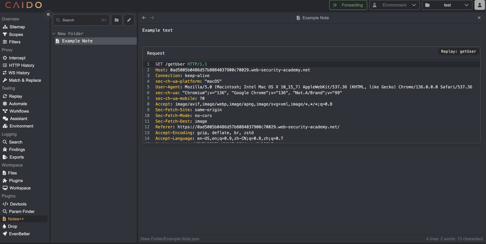
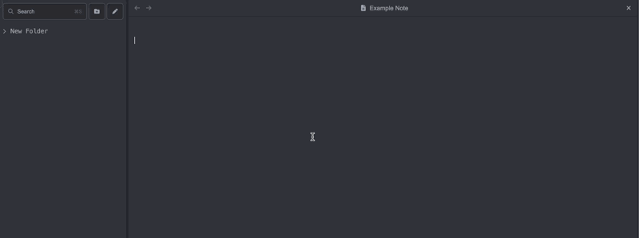
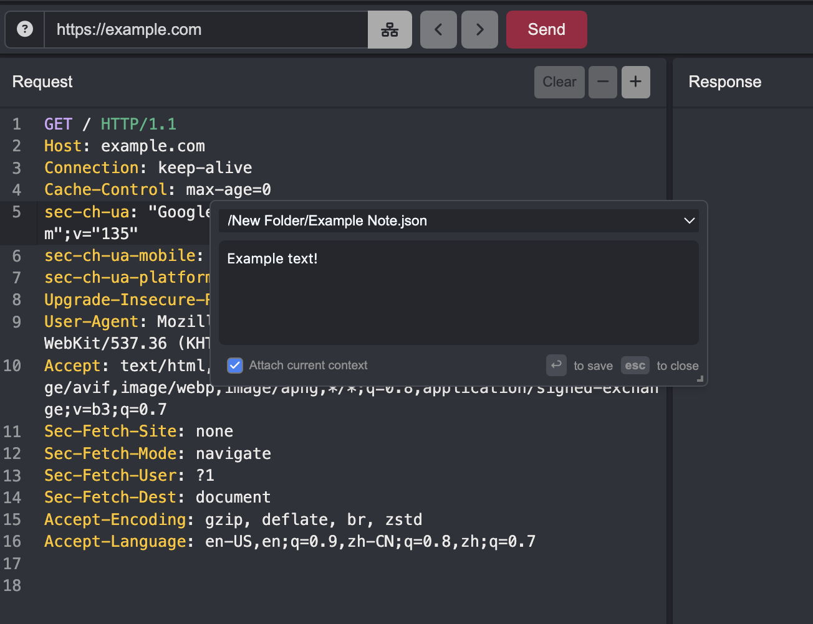

  

   
   
  <a href="https://github.com/caido-community" target="_blank">Github</a>
  &nbsp;&nbsp;•&nbsp;&nbsp;
  <a href="https://developer.caido.io/" target="_blank">Documentation</a>
  &nbsp;&nbsp;•&nbsp;&nbsp;
  <a href="https://links.caido.io/www-discord" target="_blank">Discord</a>
   
  

# Notes++
Markdown powered notes functionality within Caido!

# Features

You can reference any Replay session with `@` prefix.

# Shortcuts

`CMD + SHIFT + N` to open a floating modal.

`CTRL + SHIFT + R` to send selected text to currently selected note.

All shortcuts are customizable via Caido settings Shortcuts tab.
